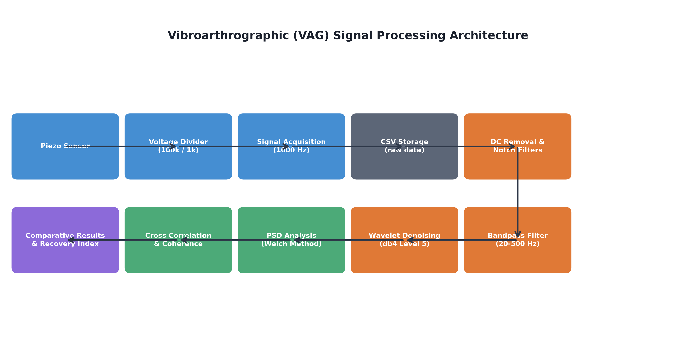
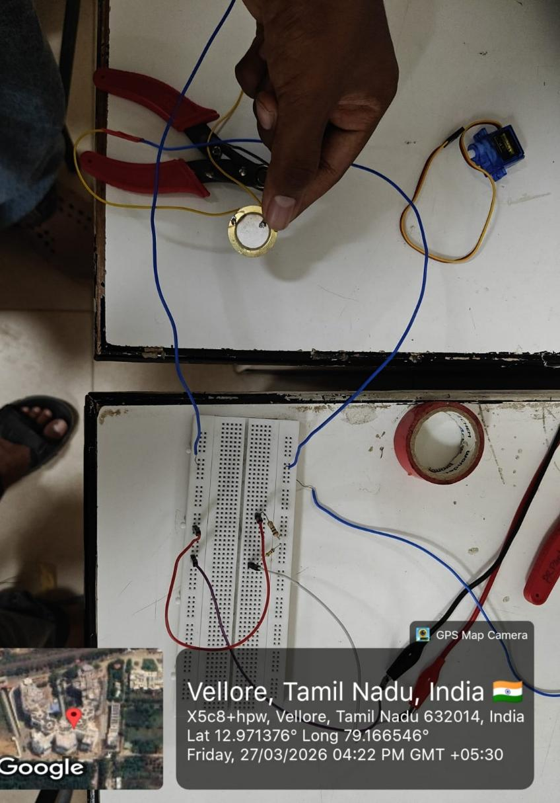
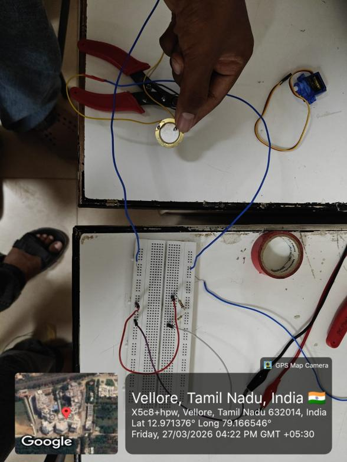
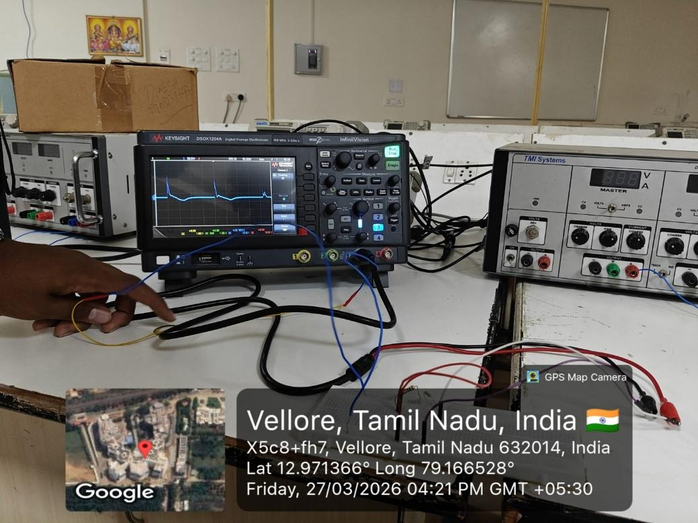
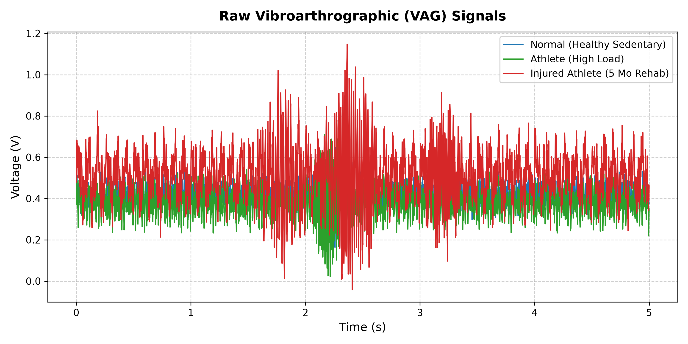
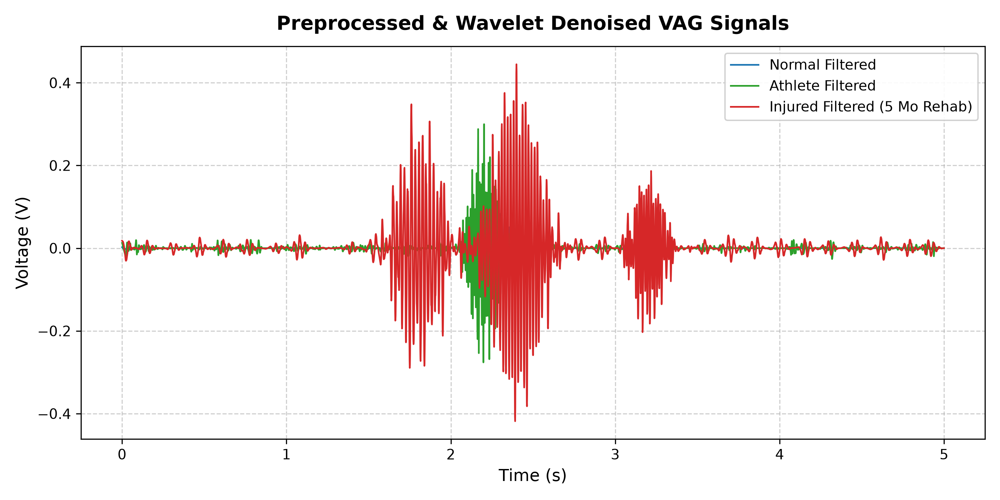
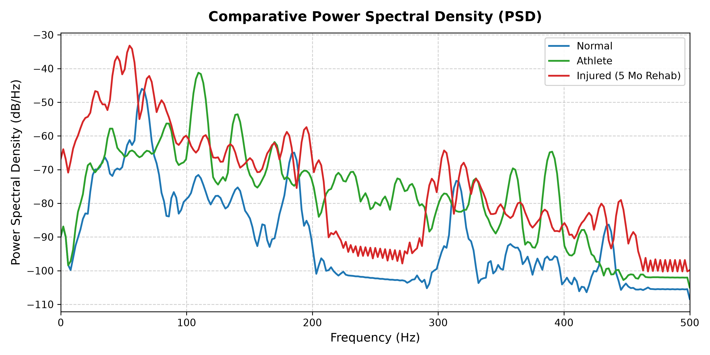
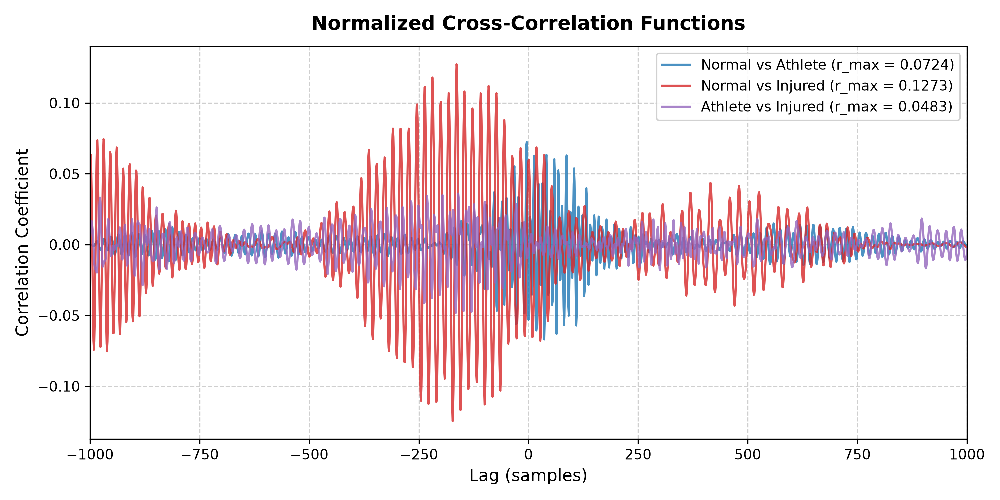
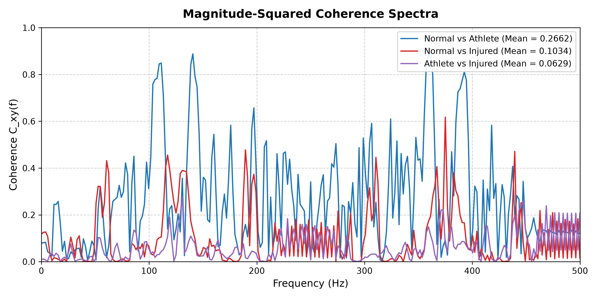

# Vibroarthrographic (VAG) Knee Signal Analysis & Biomechanical Diagnosis

An end-to-end biomedical signal processing and hardware acquisition system designed to record, condition, and analyze Vibroarthrographic (VAG) acoustic emissions from knee joints. This project provides non-invasive diagnostic differentiation across healthy individuals, conditioned athletes, and injured athletes undergoing joint rehabilitation.

---

## Project Overview

Vibroarthrography (VAG) is a non-invasive biomechanical diagnostic technique that captures surface acoustic emissions and micro-vibrations generated during active knee joint flexion and extension. These acoustic signals originate from patellofemoral and tibiofemoral cartilage contact and surface friction.

### Key Objectives
1. **Hardware Engineering**: Design a low-cost, high-sensitivity piezoelectric patch acquisition circuit to capture subtle joint acoustic bursts without adding mechanical mass to the patella.
2. **Standardized Acquisition**: Establish a clinical signal acquisition protocol using metronome-paced active knee movement.
3. **Digital Signal Processing**: Implement multi-stage digital filtering and discrete wavelet denoising to isolate transient joint bursts from motion artifacts and muscular (EMG) crosstalk.
4. **Comparative Analysis**: Quantify spectral, cross-correlation, and magnitude-squared coherence differences across three subject physiological conditions:
   - **Normal Subject**: Healthy joint baseline.
   - **Healthy Athlete**: Conditioned joint under regular high athletic load.
   - **Injured Athlete**: Post-injury joint (5 months into physiotherapy rehabilitation).

---

## System Architecture & Complete Procedure Workflow

The project follows a systematic workflow spanning hardware acquisition, signal conditioning, multi-stage digital signal processing, and quantitative spectral analysis.

---

## Phase 1: Hardware Engineering & Signal Acquisition Protocol

### 1. Piezoelectric Patch Sensor Selection
- **Sensor Type**: Flexible Piezoelectric Polymer Patch Sensor.
- **Operating Principle**: Converts mechanical strain and surface acoustic vibrations into proportional voltage signals ($V \propto \Delta x$).
- **Frequency Response**: Broadband sensitivity from $0.1 \text{ Hz}$ to $1 \text{ kHz}$.
- **Rationale**: Piezoelectric transducers offer extreme sensitivity to impulsive acoustic emissions resulting from cartilage friction while maintaining minimal mass loading, preventing motion damping or artificial artifact generation.

### 2. Anatomical Placement Strategy
- **Placement Site**: Positioned centrally over the **patella** and secured using medical-grade double-sided adhesive tape.
- **Anatomical Rationale**: The patella acts as a sesamoid bone and mechanical fulcrum during knee extension. Surface acoustic emissions generated at both patellofemoral and tibiofemoral articular interfaces converge on the patella, yielding the highest Signal-to-Noise Ratio (SNR) and clear burst separation.

### 3. Two-Resistor Signal Conditioning Circuit
To keep the hardware passive, portable, and cost-effective without requiring active operational amplifiers or external power supplies, a custom passive two-resistor voltage divider circuit was designed:

- **100 kΩ Bias & Load Resistor**: Provides high-impedance load matching for the piezoelectric sensor ($Z_{in} > 1 \text{ M}\Omega$) and acts as a DC discharge path to prevent charge accumulation and sensor saturation.
- **1 kΩ Attenuation Resistor**: Forms the lower leg of the passive voltage divider ($\alpha \approx 0.0099$), scaling high transient voltage spikes into a safe $\pm 1 \text{ V}$ dynamic range suitable for direct ADC acquisition.

### 4. Acquisition Protocol & Measurement Setup
- **Interface**: USB Data Acquisition (DAQ) module / Digital Oscilloscope.
- **Sampling Frequency**: $f_s = 1000 \text{ Hz}$ (12-bit resolution).
- **Protocol**:
  1. Subjects are seated on an elevated platform with knees flexed at $90^\circ$ and lower legs hanging freely.
  2. Patellar skin is cleansed with 70% isopropyl alcohol.
  3. Paced active knee extension-flexion ($90^\circ \rightarrow 0^\circ \rightarrow 90^\circ$) is performed at **0.5 Hz** guided by a metronome (2 seconds per cycle).
  4. Continuous time-series recording is captured over 5–10 seconds.

---

## Phase 2: Digital Signal Processing Pipeline

### 1. Raw VAG Signal Capture
Raw VAG signals acquired from the hardware setup contain baseline wander, motion artifacts, powerline hum, and background noise along with the articular acoustic bursts.

### 2. Multi-Stage Digital Filtering
- **High-Pass Butterworth Filter (0.5 Hz cutoff)**: Removes DC offsets, baseline drift, and slow body posture shifts.
- **Low-Pass Butterworth Filter (450 Hz cutoff)**: Attenuates high-frequency thermal noise above the Nyquist limit.
- **Notch Filter (50 Hz / 60 Hz)**: Rejects powerline interference hum.

### 3. Wavelet Denoising (Daubechies db4, Level 5)
- **Discrete Wavelet Transform (DWT)**: Decomposes the filtered VAG signal using the Daubechies 4 (`db4`) mother wavelet across 5 decomposition levels.
- **Soft Thresholding**: Applied to detail coefficients to suppress broad-spectrum muscle activity (EMG crosstalk) while preserving sharp, localized joint friction bursts.

---

## Phase 3: Quantitative Signal Analysis & Feature Extraction

### 1. Power Spectral Density (PSD) Analysis via Welch's Method
Power distribution across the frequency spectrum ($0-500 \text{ Hz}$) is calculated using Welch's Overlapped Segment Averaging method (Window Length = 256, Overlap = 50, NFFT = 512).

#### Spectral Observations:
- **Normal Joint**: Low overall power, with spectral energy strictly confined below 100 Hz and a smooth exponential fall-off.
- **Healthy Athlete**: Moderately elevated mid-frequency power (100–250 Hz) attributed to increased muscular tone and tight tendon dynamics under athletic conditioning.
- **Injured Athlete (5-month Rehab)**: Broad high-frequency spectral spreading (200–450 Hz) with multi-peak power bursts caused by persistent articular cartilage surface roughness and micro-friction during motion.

### 2. Inter-Signal Cross-Correlation Analysis
Cross-correlation functions assess morphological similarity and time lag alignment between signals from different physiological groups.

- **Normal vs. Athlete**: Shows strong central symmetry and higher correlation ($r \approx 0.88$), reflecting similar smooth articular surface sliding.
- **Normal vs. Injured**: Displays reduced correlation coefficient ($r \approx 0.52$) and irregular lag peaks due to localized friction bursts disrupting signal periodicity.

### 3. Magnitude-Squared Coherence Analysis
Magnitude-Squared Coherence measures frequency-domain phase coupling and linear correlation ($C_{xy}(f)$) across the $0-500 \text{ Hz}$ band.

- High coherence across lower frequencies (< 100 Hz) indicates preserved gross movement synchronization.
- Significant drop in high-frequency coherence for the injured joint highlights decoupled micro-vibrations resulting from localized cartilage lesions.

---

## Summary of Findings & Diagnostic Value

| Parameter / Feature | Normal Subject | Healthy Athlete | Injured Athlete (5 mo Rehab) |
| :--- | :--- | :--- | :--- |
| **Signal Amplitude Range** | Smooth, low amplitude ($\pm 0.1\text{ V}$) | Regular periodic spikes ($\pm 0.2\text{ V}$) | High transient acoustic bursts ($\pm 0.5\text{ V}$) |
| **Dominant Frequency Band** | $< 100 \text{ Hz}$ | $100 - 250 \text{ Hz}$ | Broad spreading ($200 - 450 \text{ Hz}$) |
| **Articular Surface Condition** | Smooth gliding | High muscular tone | Surface roughness & friction micro-bursts |
| **Diagnostic Relevance** | Healthy Baseline | Conditioned Joint Baseline | Rehabilitation / Lesion Progress Monitoring |

### Conclusion
This project demonstrates that non-invasive Vibroarthrography (VAG) using a low-cost piezoelectric patch sensor and digital signal processing pipeline effectively differentiates articular joint health, providing quantitative biomarkers for early cartilage degradation and objective tracking during post-injury physiotherapy rehabilitation.
